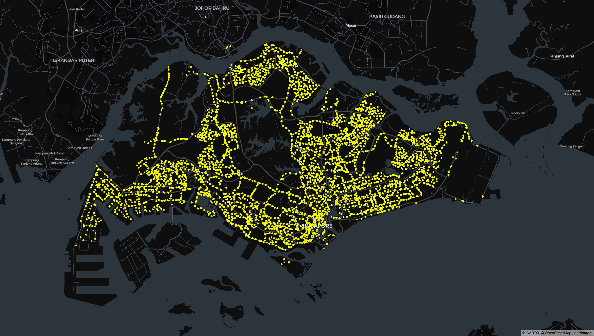

# PyDeck and Visualising Data

 |Status|
 |-|
 |**Started**|

Inspired by [exploretrees.sg](https://exploretrees.sg/). I would want to dive deeper into a different kind of data visualisation, GeoSpatial, in Python. I have dabbled in PyDeck before and wanted to practice some more.

**The Inspiration**

In this exploration, I am starting off with a familiar Data source which is LTA Data Mall. I have used this before for a project on a course for NTU-PaCE. I have an API Access Key as well plus the API documentation is good (easier to debug).

So far, I have a notebook [Data-Fetch.ipynb](./Data-Fetch.ipynb) which was for the exploration into the LTA Data Mall API. I was refreshing my memory on how to fetch the data from LTA via API. I ended up using `requests`. Then from there, it was on to parsing the data from JSON to the "easier" (my personal take) form of CSV. Then I stretched a bit and went tinkering into pydeck to visualise the 500 bus stops. You can see the initial version below.

A quick note to self:
* ✅ Reduce the zoom factor of the `viewstate` as it is quite high.
* ✅ Move on towards fetching the remaining bus stops (4.6K from 2013 so expecting maybe 5K by now).

**SG Bus Stops (First 500)**

I have updated the notebook to include ALL Bus Stops that can be obtained from the API. We were able to fetch 5071 Bus Stops in LTA's Datamall. Those bus stops were parsed following our parser from the first 500. The end result is the plot below showing the bus stops around Singapore and into Johor Bahru. Possibly of note here is that it might not look like 5K++ bus stops based on the plotted points. I think this is because of PyDeck (or us perceptually) coalescing the bus stops into a bigger collective point.

**SG ALL Bus Stops**

## Backlogs and Ideas

* Start adding more details: Bus Terminals, MRT stations/lines.
* Also explore the `SHP` files in the STATIC datasets of [LTA Datamall:Whole Island Footpath](https://datamall.lta.gov.sg/content/datamall/en/static-data.html#Whole%20Island).
* [**Stretch**] How do I edit the PyDeck visuals to allow for clicking instead of picking(hover).
* [**Stretch**] How to serve this? Might be possible to load it on Google via Appscript (maybe) + have the possibility to do some sheets to visuals connection (although that would move it more towards the JS side and away from python/Pydeck side.)

## PyDeck and Data Transfer

I have to flag here that PyDeck will bake-in the data used to plot the layers directly into the HTML file. You would notice that the HTML file size is quite big and also it grew from 75KB to 742KB when we moved from first 500 to ALL bus stops. If we open the HTML file itself, we can see that the Deck.GL layer actually has ALL the records of the lat, lon, code, description in the file. Depending on your use case, it might be a bad thing (especially if working on propietary data or NDAs).

The other alternative here is to move this to a JavaScript version and use the API calls to store it IN SESSION instead of Hard Coded. Plus, the possibility of coding this as a Google Appscript might be another alternative where the Data itself is in google and the site just loads the sheet via API.

## References and Further Readings

https://cheeaun.com/blog/2018/04/building-exploretrees-sg/ 
https://cheeaun.com/blog/2019/07/next-level-visualizations-exploretrees-sg/

