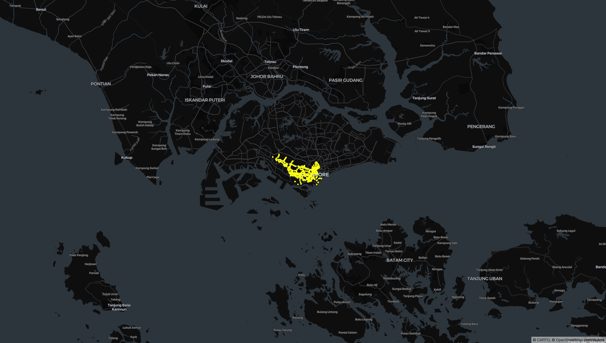

# PyDeck and Visualising Data

|||
|-|-|
|Progress|**Started**|

Inspired by [exploretrees.sg](https://exploretrees.sg/). I would want to dive deeper into a different kind of data visualisation, GeoSpatial, in Python. I have dabbled in PyDeck before and wanted to practice some more.

**The Inspiration**

In this exploration, I am starting off with a familiar Data source which is LTA Data Mall. I have used this before for a project on a course for NTU-PaCE. I have an API Access Key as well plus the API documentation is good (easier to debug).

So far, I have a notebook [Data-Fetch.ipynb](./Data-Fetch.ipynb) which was for the exploration into the LTA Data Mall API. I was refreshing my memory on how to fetch the data from LTA via API. I ended up using `requests`. Then from there, it was on to parsing the data from JSON to the "easier" (my personal take) form of CSV. Then I stretched a bit and went tinkering into pydeck to visualise the 500 bus stops. You can see the initial version below.

A quick note to self:
* Reduce the zoom factor of the `viewstate` as it is quite high.
* Move on towards fetching the remaining bus stops (4.6K from 2013 so expecting maybe 5K by now).
* Start adding more details like MRT stations
* Also explore the `SHP` files in the STATIC datasets of [LTA Datamall:Whole Island Footpath](https://datamall.lta.gov.sg/content/datamall/en/static-data.html#Whole%20Island).

**SG Bus Stops (First 500)**

## References and Further Readings

https://cheeaun.com/blog/2018/04/building-exploretrees-sg/
https://cheeaun.com/blog/2019/07/next-level-visualizations-exploretrees-sg/

