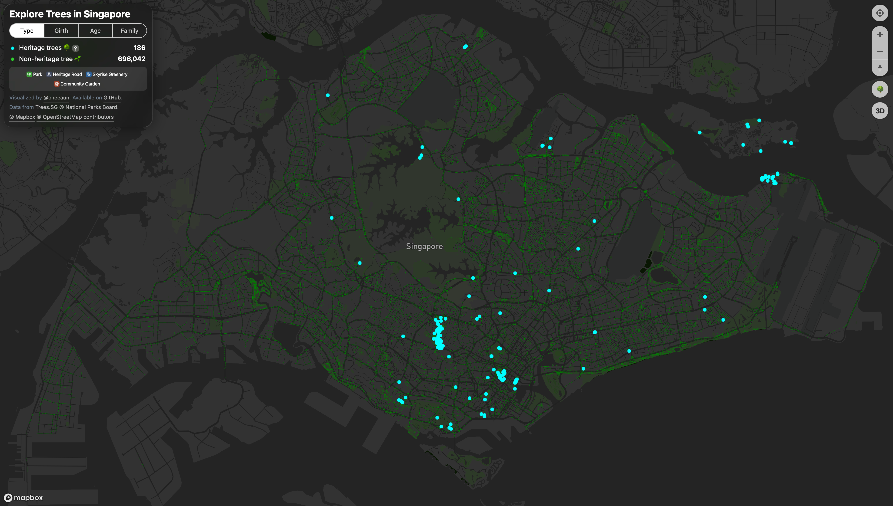

# PyDeck and Visualising Data

|||
|-|-|
|Progress|**Not Started**|

Inspired by [exploretrees.sg](https://exploretrees.sg/). I would want to dive deeper into a different kind of data visualisation, GeoSpatial, in Python. I have dabbled in PyDeck before and wanted to practice some more.

**The Inspiration**

## References and Further Readings

https://cheeaun.com/blog/2018/04/building-exploretrees-sg/
https://cheeaun.com/blog/2019/07/next-level-visualizations-exploretrees-sg/

